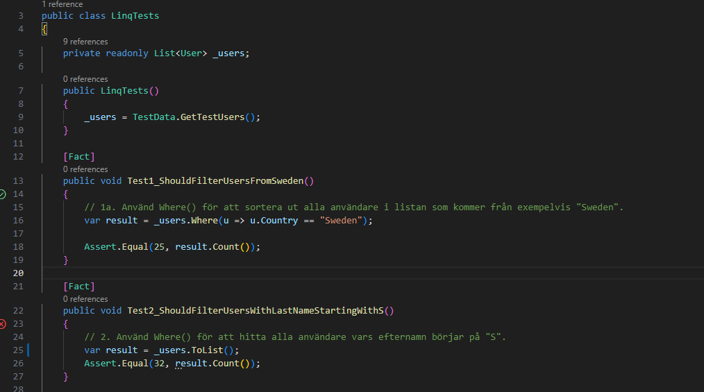
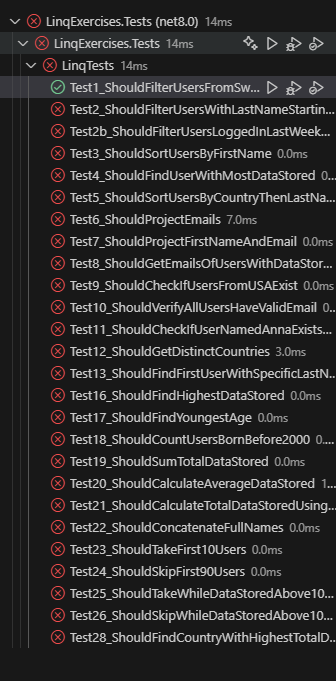

# LINQ Övningar
## Kom igång

### Installation
1. Gå in i den folder du vill hämta ner projektet. Projektet kommer hamna i sin egna mapp.
2. Kör: git clone https://github.com/TobiasLinner/LinqTestExercises.git
3. Direkt efter kör följande: 
4. ```cd LinqTestExercises```
5. ```code .```
6. I det nya Visual Studio Code fönstret som öppnats kör:
7. ```cd LinqExercises.Tests```
8. Nu kan du börja lösa testerna och köra Dotnet test eller använda Test explorer
### Arbeta med övningarna
1. Öppna `LinqTests.cs`
2. Efter "var result =" i varje test ska din lösning vara. Det är BARA den kod efter "var result = ", på den raden, som du ska ändra. Ingenting i Assert-raden.
3. När du skrivit in vad du tror är korrekt lösning så kör testet. Har du lyckats går testet igenom.
### OBS - det här är ju inte helt rätt sätt att skriva tester på, men det blir ett kul sätt att se om man skrivit "rätt".
### Exempel
Titta på Test1:


Test 1 kommer nu gå igenom medans test 2 kommer faila.




